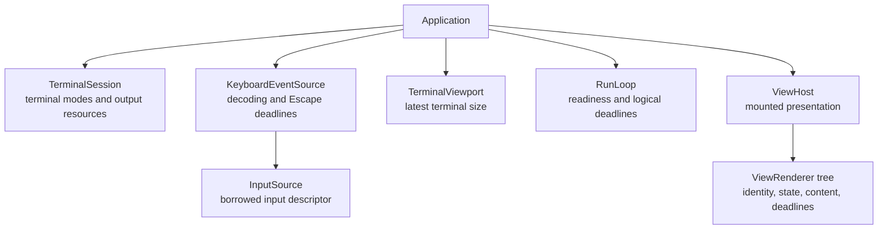
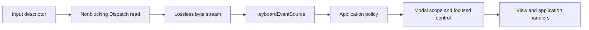

# Architecture

Twill is an event-driven terminal UI framework built around Swift Concurrency. Declarative view descriptions, mounted runtime state, scheduling, and terminal presentation have separate ownership.

[State and identity](STATE.md) defines mounted state and reconciliation. The [interaction model](INTERACTION.md) defines focus and key routing. The [run-loop contract](RUN_LOOP.md) defines readiness and logical deadlines.

## Core principles

- Serialize UI work on `MainActor`.
- Suspend when no work is pending.
- Preserve concrete view types until hosting and mounted-runtime boundaries.
- Keep identity, cached content, and scheduling state in mounted nodes.
- Share presentation scheduling across the mounted tree.
- Keep terminal ownership and cleanup explicit.

## Application and ownership

Application construction stores a root description that remains fixed for the session. It does not evaluate the root or write output. Mounting begins in `run()` after terminal setup succeeds. `EmptyView` provides an explicit non-presenting root.

Replaceable collaborators are constructor-injected, while concrete defaults are chosen at composition boundaries. Descriptors remain owned by their callers. `Application` owns lifecycle and application-level key policy. `ViewHost` owns presentation. Views neither write terminal output nor register timers.

## Execution and input

`Application.run()` owns one keyboard consumer task and one run-loop task. Viewport changes store their newest unread result and signal a registered run-loop source. UI-facing work executes on `MainActor`.

Input bytes are lossless and unbounded because dropping chunks can corrupt UTF-8 and escape sequences. `KeyboardEventSource` parses bytes, manages Escape disambiguation, and delivers keys synchronously without a task per key.

Viewport readiness and logical deadlines pass through the run loop, while keyboard input currently has an independent consumer. Actor serialization therefore does not establish a global FIFO between keyboard and scheduler events.

## Views and mounted identity

A `View` is a typed description. Primitive views provide internal descriptions directly, while result-builder composition preserves concrete child types with generics and parameter packs. Type erasure occurs only where heterogeneous mounted traversal requires it.

Persistent `ViewRenderer` nodes retain concrete type, children, owned state, cached presentation, and pending deadlines. Reconciliation updates nodes with matching structural identity and replaces nodes whose identity changes. A changed conditional branch mounts fresh content even when both branches contain the same concrete view type.

Optional absence retains its structural position so later siblings do not shift identity. Keyed collections use stable element IDs rather than positions. Generic composition type is part of structural identity. Removed nodes release their state and deadlines. The full ownership contract is defined in [State and identity](STATE.md).

## Timeline scheduling

Timeline nodes retain their schedule, current context date, and independent deadline. Periodic schedules remain anchored to their start date, and missed entries are skipped rather than replayed.

The mounted tree caches each subtree's earliest deadline. `ViewHost` registers one logical timer for the root's earliest deadline. On delivery it refreshes due subtrees, reuses unchanged siblings, combines cached and updated content, writes only changed output, and registers the next aggregate deadline. Static trees remain unscheduled, and deadlines disappear when their branches are removed.

Parent updates may reevaluate child descriptions without advancing unchanged child timelines. Equal schedules preserve timing, while changed schedule values reconfigure it. Reconstructing `.periodic(from: .now, ...)` during each parent update intentionally resets the schedule. Use a stable start date when phase must survive parent updates.

Deadlines are scheduling requests rather than real-time guarantees. Due siblings share one presentation. Scheduled evaluation continues even when it produces unchanged output, but unchanged output is not written again.

## Presentation

`ViewHost` measures mounted content into terminal cells, diffs committed frames, and serializes output. It advances the diff baseline only after a successful write. Control characters are rendered safely, and wide graphemes are never partially drawn.

State invalidation signals one coalescing presentation source. A due timeline render may consume the same pending work. Readiness is cleared before rendering so state changes during rendering request a later frame.

Resize keeps only the newest unread dimensions and redraws cached content without reevaluating view bodies or changing timeline deadlines. Static trees return to idle after presentation.

The host owns physical cursor placement. Inline presentation reserves only its frame, clears removed rows, and restores the shell cursor below it. Fullscreen presentation owns the alternate-screen lifecycle. Focus and editing state determine caret visibility without exposing terminal escape sequences to views.

### Terminal-native progress

A terminal session has one native progress indicator, shared across the application. It is separate from rendered content and occupies no layout cells. Its appearance and animation belong to the terminal emulator. Unsupported terminals may ignore progress requests.

Progress is opt-in and hidden by default. An explicit request keeps it active until withdrawn. Scoped activity keeps it active until the operation exits, including throwing or cooperatively cancelling. Overlapping operations contribute independently: finishing one cannot hide another's activity, and withdrawing an explicit request cannot hide active scopes. Reporting activity does not transfer ownership of the operation or cancel it.

Requests made before the session starts are retained without output. After shutdown begins, requests produce no further output. While active, progress may be refreshed to accommodate terminal expiry. Hidden progress schedules no refresh work, and the terminal handles animation without application-driven frames.

Progress output follows the same serialized execution and failure handling as other terminal presentation. Orderly shutdown cancels refresh work, joins owned tasks, then clears any progress the application activated. A partially failed output still requires best-effort clearing. Inherited indicator state cannot be reliably queried or restored, and multiple applications sharing a terminal can interfere with each other's requests.

## Shutdown and failures

Stop requests, keyboard EOF, cancellation, and runtime failures end the session. Shutdown deactivates run-loop work, cancels producers, joins their queue barriers and child tasks, releases mounted content, and only then restores borrowed terminal resources.

Initial setup and presentation failures throw directly. Later source or timer failures are recorded, trigger orderly shutdown, and are reported after cleanup. Every owned child result is observed so early completion cannot hide a failure still awaiting resource restoration.

The input reader restores inherited descriptor flags without closing the borrowed descriptor. Raw-mode Ctrl-C is handled as keyboard input. Terminal restoration is best-effort on orderly shutdown; crash recovery and fatal-signal cleanup are outside the runtime contract.
