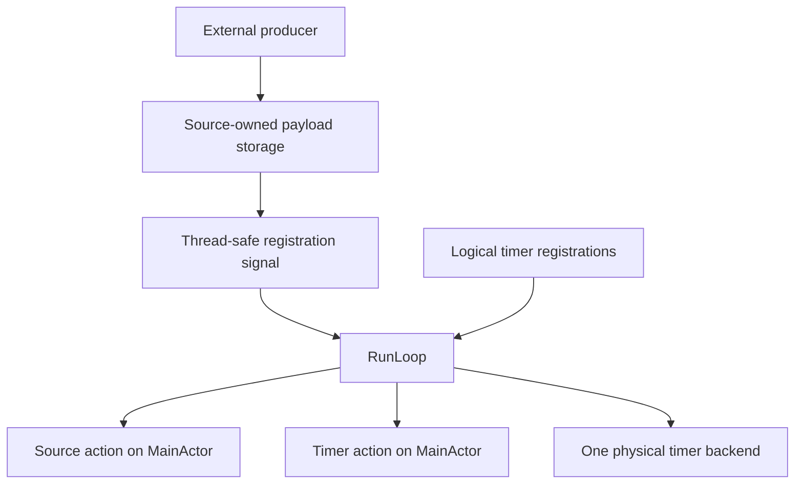

# Run loop

Twill's run loop coordinates manually signaled readiness and logical timer deadlines on `MainActor`. It suspends when no work is ready and no deadline is due.

It uses Swift Concurrency and Dispatch. It is not Foundation's `RunLoop`, a `CFRunLoop` wrapper, or a central payload queue.

## Boundaries

The run loop owns source and timer registrations, readiness, logical deadlines, callback delivery, and shutdown suppression. It does not own source payloads, external resources, mounted state, or terminal output.

Payload owners preserve their own buffering contracts. Lossless inputs retain every unread value, while latest-value inputs may replace unread state. A run-loop signal only indicates that work is ready.

## Sources

A `RunLoopSource` describes synchronous `MainActor` work. Registration returns a thread-safe, `Sendable` `RunLoopSourceRegistration` that may be signaled from an off-actor Dispatch callback without creating a task.

Signals contain no payload and do not preserve a count. Repeated signals coalesce while readiness is pending. The source owner must store its payload before signaling.

Readiness is cleared before the source action begins, so a signal raised by the action schedules a later delivery. Readiness may also be consumed without invoking the action when another path performs the same work.

Adding the same source again during one lifecycle returns its existing registration. Removal deactivates that registration. Registration and readiness generations reject queued notifications after consumption, removal, re-registration, or shutdown. Signals through an inactive registration are no-ops, allowing producer callbacks already in flight to finish safely.

Off-actor producers update only synchronized payload state and signal their registrations. They never mutate application or mounted state directly.

## Timers

A `Timer` is a logical deadline. Registering one does not create a dedicated Dispatch timer source.

The run loop retains each timer's identity, monotonic deadline, repeat interval, registration order, cancellation state, and `MainActor` action. Interval-based deadlines are anchored when registration is processed. Explicit deadlines retain the date chosen by their owner.

`DefaultRunLoop` owns one physical Dispatch timer backend. It arms that backend for the earliest logical deadline and tags each arm with a generation. Wake-ups from cancelled or superseded arms are ignored. With no logical deadline, the backend is disarmed and the run loop remains suspended.

One wake-up delivers every timer due at a controlled iteration date, ordered by deadline and registration order. A one-shot timer is removed before its action runs. A repeating timer advances from its prior scheduled deadline and skips missed periods instead of producing a catch-up burst.

Cancellation is permanent for a timer instance. It suppresses queued registration, pending delivery, and later repetitions. Each due timer is revalidated before delivery because an earlier callback may cancel it or stop the run loop.

Deadlines are scheduling requests, not real-time guarantees.

## Ordering

Source and timer actions execute serially on `MainActor`. The internal event stream preserves the order in which it observes run-loop events, but it cannot reconstruct chronology across independent operating-system, Dispatch, and actor producers.

The run loop guarantees source coalescing, timer ordering within one due set, and suppression after removal or shutdown. It does not guarantee a global FIFO, one delivery per signal, or terminal output for every wake-up. `MainActor` serialization must not be interpreted as stronger ordering.

## Lifecycle and failures

A run loop is single-use. `run()` returns after `stop()` or task cancellation.

Stopping deactivates source registrations, releases logical timers, stops the physical timer backend, finishes the event stream, and discards buffered events without invoking callbacks. The backend also cancels safely when a run loop is constructed but never entered.

External producers retain ownership of cancellation and cleanup barriers. Stopping the run loop only makes their registrations inert. Application shutdown must join producers before restoring borrowed terminal resources.

Source and timer actions are synchronous and nonthrowing. Collaborators record asynchronous failures in application-owned state, request shutdown, and report the original error after cleanup.

## Runtime clients

Presentation uses one source for invalidation and one logical timer for the mounted tree's aggregate deadline. Mounted scheduling and rendering remain defined by the [architecture contract](ARCHITECTURE.md).

Viewport observation stores its newest unread result outside the run loop and signals after updating that storage. Keyboard input remains lossless and must not rely on signal counts.

Twill does not currently implement run-loop modes, observers, per-thread loops, or nested blocking activations. Focus scopes and modal routing remain interaction concerns rather than scheduler modes.

If mode eligibility is added, mounted deadlines must be filtered before `ViewHost` aggregates them because its single timer cannot recover individual node eligibility. Input, viewport, presentation, and parser deadlines must remain eligible during tracking interactions.

## Verification invariants

Scheduling tests must use controlled monotonic dates and manual wake delivery rather than wall-clock sleeps. Coverage includes source coalescing and lifecycle invalidation, stale physical wake-ups, timer ordering and cancellation, shared physical wake-up behavior, and shutdown suppression. Integration tests use real descriptors and pseudo-terminals for platform event sources and cleanup barriers.
